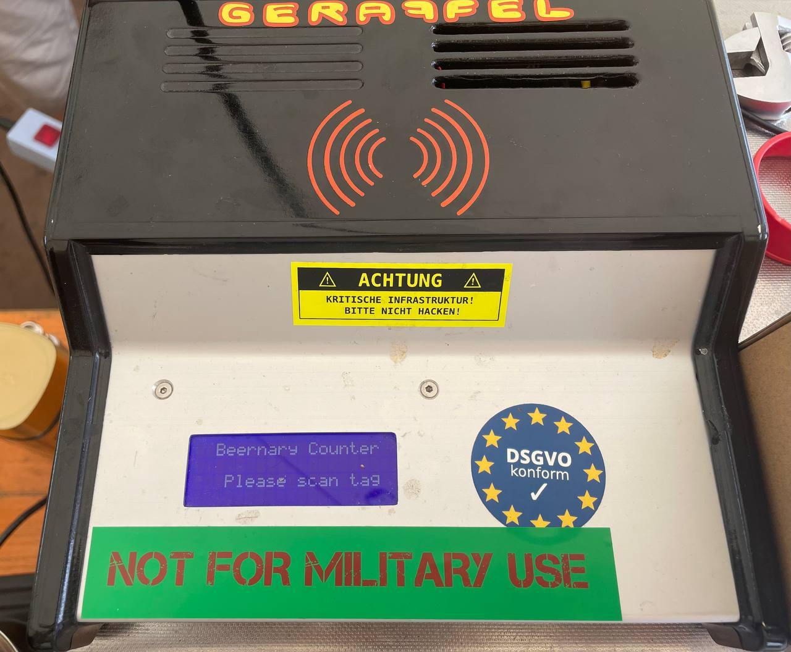
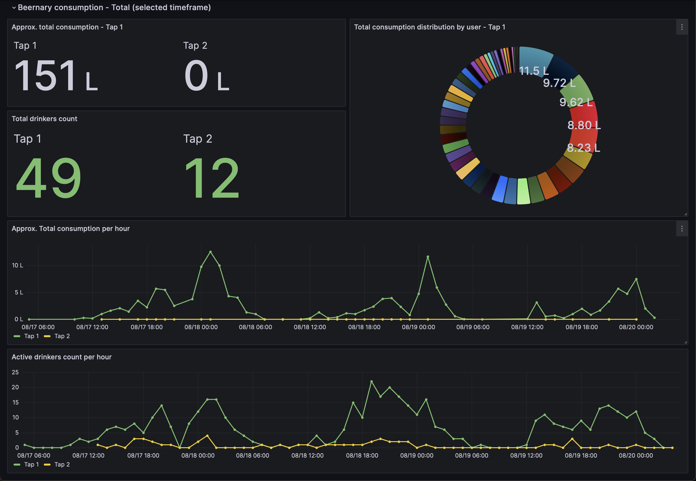

# Beernary

Hard- & software stack for authentication, authorization and accounting of your private beer tap via RFID tokens. Created by the Geraffel gang, it runs reliably on very simple and cheap hardware. 

# Additional Documentation
https://wiki.geraffel-village.de/doku.php?id=geraffel:b33rn4ry
