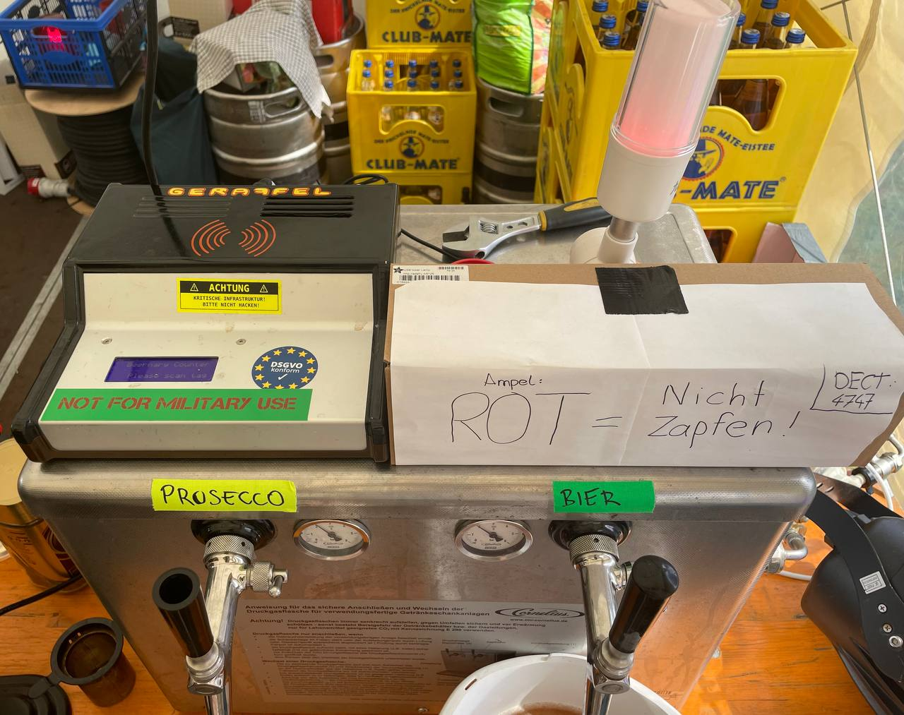

# Beernary

Hard- & software stack for authentication, authorization and accounting of your private beer tap via RFID tokens. Created by the Geraffel gang, it runs reliably on very simple and cheap hardware. 

# Additional Documentation
https://wiki.geraffel-village.de/doku.php?id=geraffel:b33rn4ry

# TODO

- Move to recent GPIO library: lgpio, gpiozero, instead of Rpi.GPIO. Currently, a compatibility shim is used to keep the Rpi.GPIO bindings, even though that library is incompatible with the current kernel
- Fix the source code transfer task to not overwrite the exec permissions set in a subsequent step